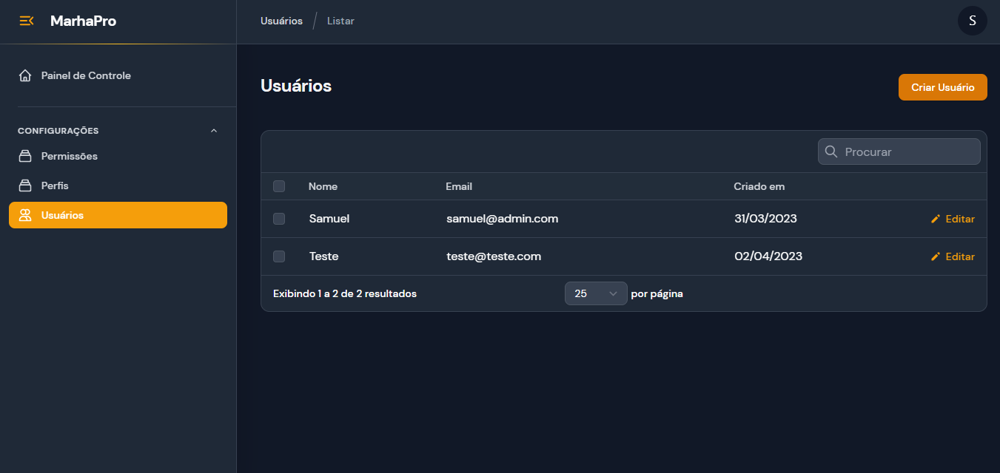

## MarhaPro - Sistema base para Gerencimento de Usuários e Permissões

Esse sistema foi desenvolvido com Laravel 10, Filament e Laravel Permissions

Clonar o projeto
configurar a base de dados
Executar comando php artisan make:seed

